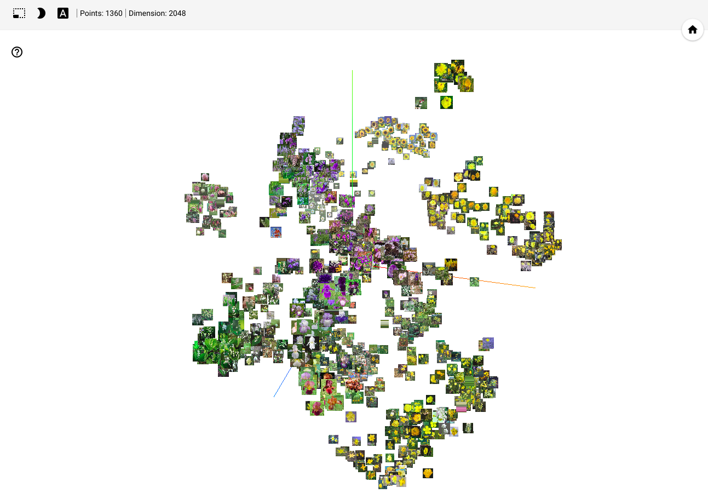

# Inception Embeddings Visualization

A script to generate tensorboard embeddings visualization of a group of images.

## Requirements

* python
* tensorflow
* tensorboard

## Installation

`pip install -r requierments.txt`

## Usage

### Generate Embeddings

`python main.py --image_dir=path_to_image_dir`

### Load Embeddings on Tensorboard

`tensorboard --logdir=/tmp/tensorboard_logs --port=9001`

Go to [http://localhost:9001](http://localhost:9001)
